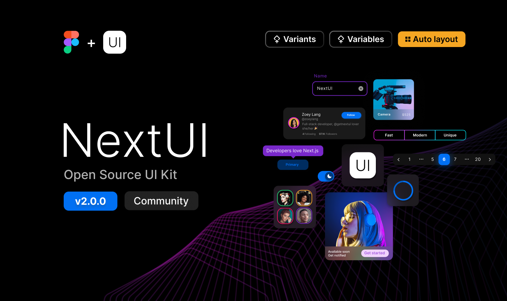

# Next UI

[![style: very good analysis][very_good_analysis_badge]][very_good_analysis_link]
[](https://github.com/felangel/mason)
[![License: MIT][license_badge]][license_link]

Beautiful, modern and fast Flutter UI library inspired by HeroUI design
principles.



## Features ✨

- **🎨 Modern Design**: Components following HeroUI design principles
- **🚀 High Performance**: Optimized for Flutter's rendering engine
- **📱 Responsive**: Works seamlessly across different screen sizes
- **🎯 Type Safe**: Built with strong typing and comprehensive enums
- **🧩 Composable**: Easy to combine and customize components
- **♿ Accessible**: Built with accessibility in mind
- **📖 Well Documented**: Comprehensive documentation and examples

## Installation 💻

**❗ In order to start using Next UI you must have the
[Flutter SDK][flutter_install_link] installed on your machine.**

Install via `flutter pub add`:

```sh
flutter pub add next_ui
```

## Quick Start 🚀

```dart
import 'package:flutter/material.dart';
import 'package:next_ui/next_ui.dart';

class MyApp extends StatelessWidget {
  @override
  Widget build(BuildContext context) {
    return MaterialApp(
      home: Scaffold(
        body: Center(
          child: Column(
            mainAxisAlignment: MainAxisAlignment.center,
            children: [
              // Button Examples
              Button.solid(
                child: Text('Primary Button'),
                onPressed: () {},
              ),
              SizedBox(height: 16),
              
              // Switch Example
              NextSwitch(
                isSelected: true,
                label: Text('Enable Feature'),
                onValueChange: (value) {},
              // Input Example
              NextInput(
                label: 'Email',
                placeholder: 'Enter your email',
                startContent: Icon(Icons.email),
              // Switch Example
              NextSwitch(
                isSelected: true,
                label: Text('Enable Feature'),
                onValueChange: (value) {},
              ),
              SizedBox(height: 16),
              
              // Input Example
              NextInput(
                label: 'Email',
                placeholder: 'Enter your email',
                startContent: Icon(Icons.email),
              ),
              SizedBox(height: 16),
              
              // Chip Example
              NextChip.solid(
                child: Text('Success'),
                color: ChipColor.success,
              ),
              SizedBox(height: 16),
              
              // Progress Example
              NextCircularProgress(
                value: 0.7,
                isIndeterminate: false,
                label: Text('70% Complete'),
              ),
            ],
          ),
        ),
      ),
    );
  }
}
```

## Components Overview 📦

### ✅ Completed Components

| Component             | Features                                                 | Status      |
| --------------------- | -------------------------------------------------------- | ----------- |
| **Button**            | 7 variants, 3 sizes, 6 colors, loading states, icons     | ✅ Complete |
| **Chip**              | 7 variants, 3 sizes, 6 colors, closable, avatar support  | ✅ Complete |
| **Switch**            | 3 sizes, 6 colors, label support, icons, disabled states | ✅ Complete |
| **Input**             | 4 variants, 3 sizes, 6 colors, validation, OTP support   | ✅ Complete |
| **Switch**            | 3 sizes, 6 colors, label support, icons, disabled states | ✅ Complete |
| **Input**             | 4 variants, 3 sizes, 6 colors, validation, OTP support   | ✅ Complete |
| **Checkbox**          | 3 sizes, 6 colors, indeterminate state, validation       | ✅ Complete |
| **Checkbox Group**    | Multi-selection, validation, orientation control         | ✅ Complete |
| **Radio Group**       | Single selection, validation, horizontal/vertical layout | ✅ Complete |
| **Circular Progress** | Determinate/indeterminate, custom labels, stroke width   | ✅ Complete |
| **Typography**        | H1-H6, paragraph, caption, multiple weights              | ✅ Complete |

### 🚧 Roadmap

| Planned Components | Status     |
| ------------------ | ---------- |
| Button Group       | 🔄 Planned |
| Card               | 🔄 Planned |
| Input/TextField    | 🔄 Planned |
| Switch             | 🔄 Planned |
| Input/TextField    | 🔄 Planned |
| Switch             | 🔄 Planned |
| Avatar             | 🔄 Planned |
| Badge              | 🔄 Planned |
| Modal              | 🔄 Planned |
| Dropdown           | 🔄 Planned |
| Table              | 🔄 Planned |
| Tooltip            | 🔄 Planned |
| Navbar             | 🔄 Planned |
| Pagination         | 🔄 Planned |
| Dark Mode Support  | 🔄 Planned |

## Component Examples 📚

### Button

```dart
// Variants
Button.solid(child: Text('Solid'), onPressed: () {});
Button.bordered(child: Text('Bordered'), onPressed: () {});
Button.light(child: Text('Light'), onPressed: () {});
Button.ghost(child: Text('Ghost'), onPressed: () {});

// Colors
Button.solid(
  color: ButtonColor.primary,
  child: Text('Primary'),
  onPressed: () {},
);

// Sizes
Button.solid(
  size: ButtonSize.lg,
  child: Text('Large'),
  onPressed: () {},
);

// Loading State
Button.solid(
  isLoading: true,
  child: Text('Loading...'),
  onPressed: () {},
);

// With Icons
Button.solid(
  startContent: Icon(Icons.download),
  child: Text('Download'),
  onPressed: () {},
);
```

### Chip

```dart
// Basic Chip
NextChip.solid(child: Text('Solid Chip'));

// With Avatar
NextChip.solid(
  avatar: CircleAvatar(child: Text('A')),
  child: Text('Avatar Chip'),
);

// Closable
NextChip.solid(
  child: Text('Closable'),
  onClose: (event) => print('Chip closed'),
);

// Dot Variant
NextChip.dot(
  color: ChipColor.success,
  child: Text('Status'),
);
```

### Switch

```dart
// Basic Switch
NextSwitch(
  isSelected: true,
  onValueChange: (value) => print('Switch: $value'),
);

// Switch with Label
NextSwitch(
  isSelected: false,
  label: Text('Enable notifications'),
  onValueChange: (value) {},
);

// Switch Sizes
NextSwitch.small(isSelected: true);   // Small
NextSwitch.medium(isSelected: true);  // Medium (default)
NextSwitch.large(isSelected: true);   // Large

// Switch Colors
NextSwitch(
  color: SwitchColor.primary,
  isSelected: true,
  onValueChange: (value) {},
);

// Switch with Icons
NextSwitch(
  isSelected: true,
  label: Text('Dark Mode'),
  startContent: Icon(Icons.dark_mode),
  thumbIcon: Icon(Icons.check, size: 16, color: Colors.white),
  onValueChange: (value) {},
);

// Disabled Switch
NextSwitch(
  isSelected: true,
  isDisabled: true,
  label: Text('Disabled'),
);

// Read-only Switch
NextSwitch(
  isSelected: true,
  isReadOnly: true,
  label: Text('Read-only'),
);

// Controlled Switch
bool isEnabled = false;

NextSwitch(
  isSelected: isEnabled,
  label: Text('Toggle Feature'),
  onValueChange: (value) {
    setState(() {
      isEnabled = value;
    });
  },
### Input

```dart
// Basic Input
NextInput(
  label: 'Username',
  placeholder: 'Enter your username',
);

// Input Variants
NextInput(variant: InputVariant.flat);      // Default
NextInput(variant: InputVariant.bordered);  // With border
NextInput(variant: InputVariant.faded);     // Faded background
NextInput(variant: InputVariant.underlined);// Underlined

// Colors and Sizes
NextInput(
  color: InputColor.primary,
  size: InputSize.lg,
  label: 'Large Primary Input',
);

// Password Input
NextInput(
  label: 'Password',
  obscureText: true,
  startContent: Icon(Icons.lock),
);

// Input with Validation
NextInput(
  label: 'Email',
  isRequired: true,
  isInvalid: emailError,
  errorMessage: 'Please enter a valid email',
  keyboardType: TextInputType.emailAddress,
);

// Clearable Input
NextInput(
  label: 'Search',
  isClearable: true,
  startContent: Icon(Icons.search),
);

// Textarea
NextInput(
  label: 'Message',
  maxLines: 4,
  description: 'Tell us what you think',
);

// Label Placements
NextInput(
  labelPlacement: LabelPlacement.outside,
  label: 'Outside Label',
);
```

### Input OTP

```dart
// Basic 6-digit OTP
NextInputOTP(
  length: 6,
  onCompleted: (value) => print('OTP: $value'),
);

// Custom 4-digit OTP
NextInputOTP(
  length: 4,
  size: InputSize.lg,
  color: InputColor.success,
  spacing: 12,
);

// OTP with Separator
NextInputOTP(
  length: 6,
  separator: Text('-', style: TextStyle(fontSize: 24)),
);

// Secure OTP
NextInputOTP(
  length: 4,
  obscureText: true,
  keyboardType: TextInputType.number,
### Switch

```dart
// Basic Switch
NextSwitch(
  isSelected: true,
  onValueChange: (value) => print('Switch: $value'),
);

// Switch with Label
NextSwitch(
  isSelected: false,
  label: Text('Enable notifications'),
  onValueChange: (value) {},
);

// Switch Sizes
NextSwitch.small(isSelected: true);   // Small
NextSwitch.medium(isSelected: true);  // Medium (default)
NextSwitch.large(isSelected: true);   // Large

// Switch Colors
NextSwitch(
  color: SwitchColor.primary,
  isSelected: true,
  onValueChange: (value) {},
);

// Switch with Icons
NextSwitch(
  isSelected: true,
  label: Text('Dark Mode'),
  startContent: Icon(Icons.dark_mode),
  thumbIcon: Icon(Icons.check, size: 16, color: Colors.white),
  onValueChange: (value) {},
);

// Disabled Switch
NextSwitch(
  isSelected: true,
  isDisabled: true,
  label: Text('Disabled'),
);

// Read-only Switch
NextSwitch(
  isSelected: true,
  isReadOnly: true,
  label: Text('Read-only'),
);

// Controlled Switch
bool isEnabled = false;

NextSwitch(
  isSelected: isEnabled,
  label: Text('Toggle Feature'),
  onValueChange: (value) {
    setState(() {
      isEnabled = value;
    });
  },
### Input

```dart
// Basic Input
NextInput(
  label: 'Username',
  placeholder: 'Enter your username',
);

// Input Variants
NextInput(variant: InputVariant.flat);      // Default
NextInput(variant: InputVariant.bordered);  // With border
NextInput(variant: InputVariant.faded);     // Faded background
NextInput(variant: InputVariant.underlined);// Underlined

// Colors and Sizes
NextInput(
  color: InputColor.primary,
  size: InputSize.lg,
  label: 'Large Primary Input',
);

// Password Input
NextInput(
  label: 'Password',
  obscureText: true,
  startContent: Icon(Icons.lock),
);

// Input with Validation
NextInput(
  label: 'Email',
  isRequired: true,
  isInvalid: emailError,
  errorMessage: 'Please enter a valid email',
  keyboardType: TextInputType.emailAddress,
);

// Clearable Input
NextInput(
  label: 'Search',
  isClearable: true,
  startContent: Icon(Icons.search),
);

// Textarea
NextInput(
  label: 'Message',
  maxLines: 4,
  description: 'Tell us what you think',
);

// Label Placements
NextInput(
  labelPlacement: LabelPlacement.outside,
  label: 'Outside Label',
);
```

### Input OTP

```dart
// Basic 6-digit OTP
NextInputOTP(
  length: 6,
  onCompleted: (value) => print('OTP: $value'),
);

// Custom 4-digit OTP
NextInputOTP(
  length: 4,
  size: InputSize.lg,
  color: InputColor.success,
  spacing: 12,
);

// OTP with Separator
NextInputOTP(
  length: 6,
  separator: Text('-', style: TextStyle(fontSize: 24)),
);

// Secure OTP
NextInputOTP(
  length: 4,
  obscureText: true,
  keyboardType: TextInputType.number,
);
```

### Checkbox

```dart
// Basic Checkbox
NextCheckbox(
  children: Text('Accept terms'),
  onValueChange: (value) => print('Value: $value'),
);

// Indeterminate
NextCheckbox(
  children: Text('Select All'),
  isIndeterminate: true,
);

// Checkbox Group
NextCheckboxGroup(
  label: 'Select your interests',
  children: [
    NextGroupCheckbox(value: 'sports', children: Text('Sports')),
    NextGroupCheckbox(value: 'music', children: Text('Music')),
    NextGroupCheckbox(value: 'travel', children: Text('Travel')),
  ],
);
```

### Radio Group

```dart
RadioGroup(
  label: Text('Choose framework'),
  children: [
    NextRadio(value: 'flutter', child: Text('Flutter')),
    NextRadio(value: 'react', child: Text('React Native')),
    NextRadio(value: 'native', child: Text('Native')),
  ],
);

// Horizontal Layout
RadioGroup(
  orientation: RadioGroupOrientation.horizontal,
  children: [
    NextRadio(value: 'yes', child: Text('Yes')),
    NextRadio(value: 'no', child: Text('No')),
  ],
);
```

### Circular Progress

```dart
// Indeterminate
NextCircularProgress(
  label: Text('Loading...'),
);

// Determinate
NextCircularProgress(
  value: 0.75,
  isIndeterminate: false,
  label: Text('Progress'),
  showValueLabel: true,
);

// Custom Colors and Sizes
NextCircularProgress(
  value: 0.8,
  color: CircularProgressColor.success,
  size: CircularProgressSize.lg,
  strokeWidth: 4,
  label: Text('Upload Complete'),
);
```

## Example App 📱

The package includes a comprehensive example app showcasing all components:

```sh
cd example
flutter run
```

The example app features:

- **7 Interactive Tabs**: Buttons, Chips, Switches, Checkboxes, Radio Groups,
- **7 Interactive Tabs**: Buttons, Chips, Inputs, Checkboxes, Radio Groups,
- **7 Interactive Tabs**: Buttons, Chips, Switches, Inputs, Checkboxes, Radio Groups,
  Progress, Typography
- **Live Demonstrations**: All variants, sizes, colors, and states
- **Interactive Controls**: Real-time component customization
- **Best Practices**: Proper usage patterns and code examples

## Theme Customization 🎨

Next UI components integrate with Flutter's Material Theme:

```dart
MaterialApp(
  theme: ThemeData(
    colorScheme: ColorScheme.fromSeed(seedColor: Colors.blue),
    textTheme: TextTheme(
      headlineSmall: TextStyle(fontSize: 18, fontWeight: FontWeight.bold),
    ),
  ),
  home: MyHomePage(),
);
```

### Custom Colors

```dart
// Components support multiple color variants
Button.solid(color: ButtonColor.primary);    // Blue
Button.solid(color: ButtonColor.success);    // Green  
Button.solid(color: ButtonColor.warning);    // Orange
Button.solid(color: ButtonColor.danger);     // Red
Button.solid(color: ButtonColor.secondary);  // Purple
```

## API Reference 📖

### Button

| Property       | Type            | Description    |
| -------------- | --------------- | -------------- |
| `child`        | `Widget?`       | Button content |
| `onPressed`    | `VoidCallback?` | Tap callback   |
| `variant`      | `ButtonVariant` | Visual style   |
| `color`        | `ButtonColor`   | Color theme    |
| `size`         | `ButtonSize`    | Button size    |
| `isLoading`    | `bool`          | Loading state  |
| `isDisabled`   | `bool`          | Disabled state |
| `startContent` | `Widget?`       | Leading icon   |
| `endContent`   | `Widget?`       | Trailing icon  |

### NextChip

| Property       | Type          | Description      |
| -------------- | ------------- | ---------------- |
| `child`        | `Widget?`     | Chip content     |
| `variant`      | `ChipVariant` | Visual style     |
| `color`        | `ChipColor`   | Color theme      |
| `size`         | `ChipSize`    | Chip size        |
| `avatar`       | `Widget?`     | Avatar widget    |
| `onClose`      | `Function?`   | Close callback   |
| `startContent` | `Widget?`     | Leading content  |
| `endContent`   | `Widget?`     | Trailing content |

### NextSwitch

| Property           | Type                  | Description                |
| ------------------ | --------------------- | -------------------------- |
| `value`            | `String?`             | Form field value           |
| `isSelected`       | `bool?`               | Whether switch is selected |
| `defaultSelected`  | `bool`                | Default selected state     |
| `onChanged`        | `ValueChanged<bool>?` | Native change callback     |
| `onValueChange`    | `ValueChanged<bool>?` | Value change callback      |
| `size`             | `SwitchSize`          | Switch size (sm, md, lg)   |
| `color`            | `SwitchColor`         | Color theme                |
| `label`            | `Widget?`             | Label widget               |
| `startContent`     | `Widget?`             | Leading content widget     |
| `endContent`       | `Widget?`             | Trailing content widget    |
| `thumbIcon`        | `Widget?`             | Icon inside thumb          |
| `isDisabled`       | `bool`                | Disabled state             |
| `isReadOnly`       | `bool`                | Read-only state            |
| `disableAnimation` | `bool`                | Disable animations         |
| `name`             | `String?`             | Form field name            |
| `autofocus`        | `bool`                | Auto-focus on mount        |
| `focusNode`        | `FocusNode?`          | Focus node                 |
| `margin`           | `EdgeInsetsGeometry?` | External margin            |
| `padding`          | `EdgeInsetsGeometry?` | Internal padding           |
### NextInput

| Property         | Type                     | Description              |
| ---------------- | ------------------------ | ------------------------ |
| `controller`     | `TextEditingController?` | Text editing controller  |
| `value`          | `String?`                | Initial text value       |
| `onChanged`      | `ValueChanged<String>?`  | Text change callback     |
| `onSubmitted`    | `ValueChanged<String>?`  | Submit callback          |
| `onClear`        | `VoidCallback?`          | Clear button callback    |
| `variant`        | `InputVariant`           | Visual style variant     |
| `color`          | `InputColor`             | Color theme              |
| `size`           | `InputSize`              | Input field size         |
| `radius`         | `InputRadius`            | Border radius            |
| `labelPlacement` | `LabelPlacement`         | Label position           |
| `label`          | `String?`                | Label text               |
| `placeholder`    | `String?`                | Placeholder text         |
| `description`    | `String?`                | Helper description       |
| `errorMessage`   | `String?`                | Error message            |
| `startContent`   | `Widget?`                | Leading widget           |
| `endContent`     | `Widget?`                | Trailing widget          |
| `isRequired`     | `bool`                   | Required field indicator |
| `isDisabled`     | `bool`                   | Disabled state           |
| `isReadOnly`     | `bool`                   | Read-only state          |
| `isInvalid`      | `bool`                   | Invalid state            |
| `isClearable`    | `bool`                   | Show clear button        |
| `obscureText`    | `bool`                   | Password mode            |
| `maxLines`       | `int?`                   | Maximum lines            |
| `keyboardType`   | `TextInputType?`         | Keyboard type            |

### NextInputOTP

| Property       | Type                    | Description             |
| -------------- | ----------------------- | ----------------------- |
| `length`       | `int`                   | Number of OTP digits    |
| `onChanged`    | `ValueChanged<String>?` | Value change callback   |
| `onCompleted`  | `ValueChanged<String>?` | Completion callback     |
| `separator`    | `Widget?`               | Custom separator widget |
| `size`         | `InputSize`             | Input field size        |
| `color`        | `InputColor`            | Color theme             |
| `spacing`      | `double`                | Spacing between fields  |
| `isDisabled`   | `bool`                  | Disabled state          |
| `isInvalid`    | `bool`                  | Invalid state           |
| `obscureText`  | `bool`                  | Hide input text         |
| `keyboardType` | `TextInputType`         | Keyboard type           |
### NextSwitch

| Property           | Type                  | Description                |
| ------------------ | --------------------- | -------------------------- |
| `value`            | `String?`             | Form field value           |
| `isSelected`       | `bool?`               | Whether switch is selected |
| `defaultSelected`  | `bool`                | Default selected state     |
| `onChanged`        | `ValueChanged<bool>?` | Native change callback     |
| `onValueChange`    | `ValueChanged<bool>?` | Value change callback      |
| `size`             | `SwitchSize`          | Switch size (sm, md, lg)   |
| `color`            | `SwitchColor`         | Color theme                |
| `label`            | `Widget?`             | Label widget               |
| `startContent`     | `Widget?`             | Leading content widget     |
| `endContent`       | `Widget?`             | Trailing content widget    |
| `thumbIcon`        | `Widget?`             | Icon inside thumb          |
| `isDisabled`       | `bool`                | Disabled state             |
| `isReadOnly`       | `bool`                | Read-only state            |
| `disableAnimation` | `bool`                | Disable animations         |
| `name`             | `String?`             | Form field name            |
| `autofocus`        | `bool`                | Auto-focus on mount        |
| `focusNode`        | `FocusNode?`          | Focus node                 |
| `margin`           | `EdgeInsetsGeometry?` | External margin            |
| `padding`          | `EdgeInsetsGeometry?` | Internal padding           |
### NextInput

| Property         | Type                     | Description              |
| ---------------- | ------------------------ | ------------------------ |
| `controller`     | `TextEditingController?` | Text editing controller  |
| `value`          | `String?`                | Initial text value       |
| `onChanged`      | `ValueChanged<String>?`  | Text change callback     |
| `onSubmitted`    | `ValueChanged<String>?`  | Submit callback          |
| `onClear`        | `VoidCallback?`          | Clear button callback    |
| `variant`        | `InputVariant`           | Visual style variant     |
| `color`          | `InputColor`             | Color theme              |
| `size`           | `InputSize`              | Input field size         |
| `radius`         | `InputRadius`            | Border radius            |
| `labelPlacement` | `LabelPlacement`         | Label position           |
| `label`          | `String?`                | Label text               |
| `placeholder`    | `String?`                | Placeholder text         |
| `description`    | `String?`                | Helper description       |
| `errorMessage`   | `String?`                | Error message            |
| `startContent`   | `Widget?`                | Leading widget           |
| `endContent`     | `Widget?`                | Trailing widget          |
| `isRequired`     | `bool`                   | Required field indicator |
| `isDisabled`     | `bool`                   | Disabled state           |
| `isReadOnly`     | `bool`                   | Read-only state          |
| `isInvalid`      | `bool`                   | Invalid state            |
| `isClearable`    | `bool`                   | Show clear button        |
| `obscureText`    | `bool`                   | Password mode            |
| `maxLines`       | `int?`                   | Maximum lines            |
| `keyboardType`   | `TextInputType?`         | Keyboard type            |

### NextInputOTP

| Property       | Type                    | Description             |
| -------------- | ----------------------- | ----------------------- |
| `length`       | `int`                   | Number of OTP digits    |
| `onChanged`    | `ValueChanged<String>?` | Value change callback   |
| `onCompleted`  | `ValueChanged<String>?` | Completion callback     |
| `separator`    | `Widget?`               | Custom separator widget |
| `size`         | `InputSize`             | Input field size        |
| `color`        | `InputColor`            | Color theme             |
| `spacing`      | `double`                | Spacing between fields  |
| `isDisabled`   | `bool`                  | Disabled state          |
| `isInvalid`    | `bool`                  | Invalid state           |
| `obscureText`  | `bool`                  | Hide input text         |
| `keyboardType` | `TextInputType`         | Keyboard type           |

### NextCheckbox

| Property          | Type                  | Description         |
| ----------------- | --------------------- | ------------------- |
| `children`        | `Widget?`             | Label content       |
| `isSelected`      | `bool?`               | Selection state     |
| `onValueChange`   | `ValueChanged<bool>?` | Change callback     |
| `color`           | `CheckboxColor`       | Color theme         |
| `size`            | `CheckboxSize`        | Checkbox size       |
| `isIndeterminate` | `bool`                | Indeterminate state |
| `isDisabled`      | `bool`                | Disabled state      |
| `isInvalid`       | `bool`                | Invalid state       |

## Contributing 🤝

We welcome contributions! Please see our [Contributing Guide](CONTRIBUTING.md)
for details.

1. Fork the repository
2. Create your feature branch (`git checkout -b feature/amazing-feature`)
3. Commit your changes (`git commit -m 'Add amazing feature'`)
4. Push to the branch (`git push origin feature/amazing-feature`)
5. Open a Pull Request

## Testing 🧪

For first time users, install the [very_good_cli][very_good_cli_link]:

```sh
dart pub global activate very_good_cli
```

To run all unit tests:

```sh
very_good test --coverage
```

To view the generated coverage report you can use
[lcov](https://github.com/linux-test-project/lcov):

```sh
# Generate Coverage Report
genhtml coverage/lcov.info -o coverage/

# Open Coverage Report
open coverage/index.html
```

## License 📄

This project is licensed under the MIT License - see the [LICENSE](LICENSE) file
for details.

---

## Links & References 🔗

- [Flutter Documentation][flutter_install_link]
- [HeroUI Design System](https://heroui.com/)
- [Material Design 3](https://m3.material.io/)

[flutter_install_link]: https://docs.flutter.dev/get-started/install
[github_actions_link]: https://docs.github.com/en/actions/learn-github-actions
[license_badge]: https://img.shields.io/badge/license-MIT-blue.svg
[license_link]: https://opensource.org/licenses/MIT
[logo_black]: https://raw.githubusercontent.com/VGVentures/very_good_brand/main/styles/README/vgv_logo_black.png#gh-light-mode-only
[logo_white]: https://raw.githubusercontent.com/VGVentures/very_good_brand/main/styles/README/vgv_logo_white.png#gh-dark-mode-only
[mason_link]: https://github.com/felangel/mason
[very_good_analysis_badge]: https://img.shields.io/badge/style-very_good_analysis-B22C89.svg
[very_good_analysis_link]: https://pub.dev/packages/very_good_analysis
[very_good_cli_link]: https://pub.dev/packages/very_good_cli
[very_good_coverage_link]: https://github.com/marketplace/actions/very-good-coverage
[very_good_ventures_link]: https://verygood.ventures
[very_good_ventures_link_light]: https://verygood.ventures#gh-light-mode-only
[very_good_ventures_link_dark]: https://verygood.ventures#gh-dark-mode-only
[very_good_workflows_link]: https://github.com/VeryGoodOpenSource/very_good_workflows
